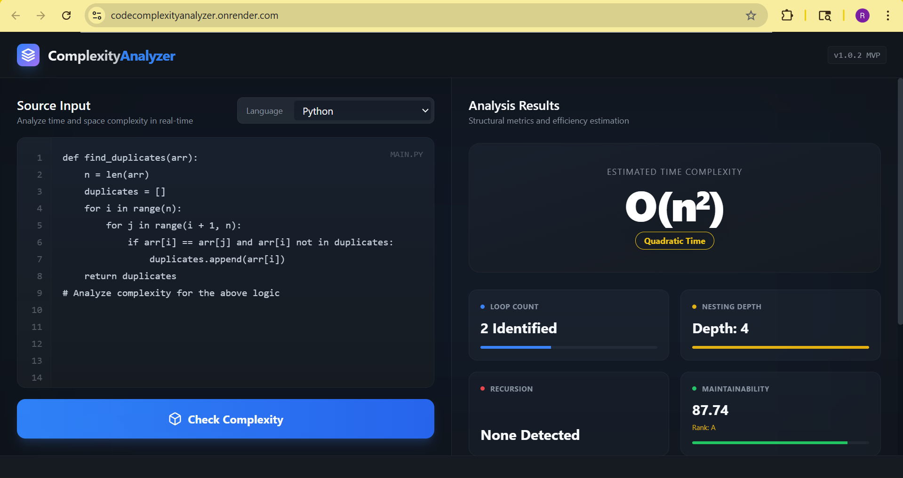
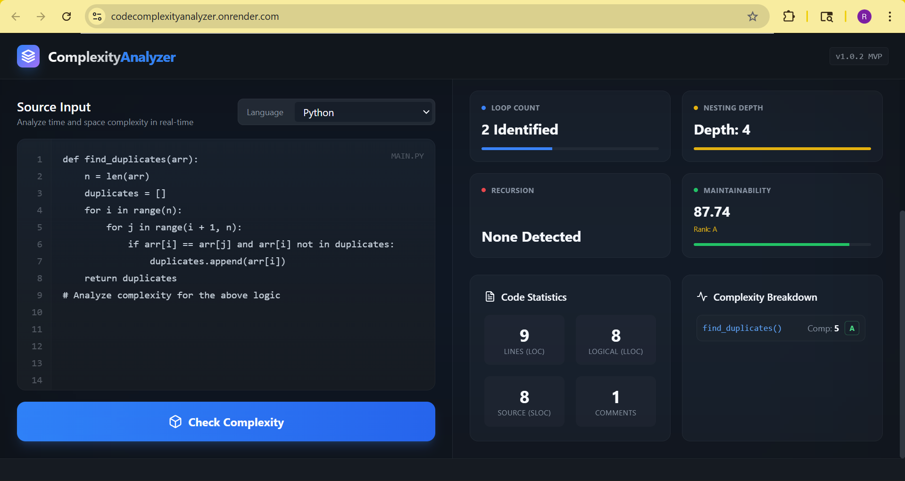

# 🚀 Code Complexity Analyzer

> ⚡ Analyze the **time and space complexity** of code snippets instantly — built to simplify understanding of algorithm efficiency.

---

## 🌐 Live Demo

🚀 **Try it here:**
👉 https://codecomplexityanalyzer.onrender.com/

---

## 📌 Overview

The **Code Complexity Analyzer** is a smart web-based tool that helps developers evaluate the efficiency of their code by identifying its **time and space complexity**.

Whether you're preparing for **DSA interviews**, optimizing solutions, or learning algorithms — this tool provides quick insights into how your code performs.

---

## ✨ Key Features

* 🔍 **Automatic Complexity Detection**
  Identifies common patterns like loops, nested loops, and recursion.

* ⚡ **Instant Analysis**
  Get results in real-time with minimal delay.

* 🧠 **Beginner Friendly**
  Helps students understand how code translates to Big-O notation.

* 💻 **Clean UI/UX**
  Simple and intuitive interface for smooth interaction.

* 📊 **Supports Multiple Code Inputs**
  Analyze different snippets quickly and efficiently.

---

## 🧠 How It Works

1. ✍️ User inputs a code snippet
2. ⚙️ The system parses the structure of the code
3. 🔄 Detects patterns (loops, nesting, recursion, etc.)
4. 📈 Maps patterns to **Big-O complexity**
5. ✅ Displays the result instantly

---

## 📸 Screenshots

### Homepage

### Result

```

---

## ⚙️ Installation & Setup

```bash
# Clone the repository
git clone https://github.com/rajalaxmeparida/Code-Complexity-Analyser.git

# Navigate to project folder
cd Code-Complexity-Analyser

# Open in browser
open index.html
```

---

## 🚀 Usage

1. Open the application
2. Paste your code snippet
3. Click **Check Complexity**
4. View the detected complexity

---

## 📂 Project Structure

```
Code-Complexity-Analyser/
│── index.html
│── style.css
│── script.js
│── /screenshots
│── README.md
```

---

## 🌟 Future Enhancements

* 🔮 Support for multiple programming languages
* 🤖 AI-based complexity prediction
* 📊 Visualization of execution steps
* 🧪 Unit testing integration
* 🌐 Deploy as a scalable web app

---

## 👨‍💻 Author

**Rajalaxmi Parida**

* 💼 GitHub: https://github.com/rajalaxmeparida
* 🚀 Passionate about Full Stack Development & AI

---

## 📜 License

This project is open-source and available under the **MIT License**.
